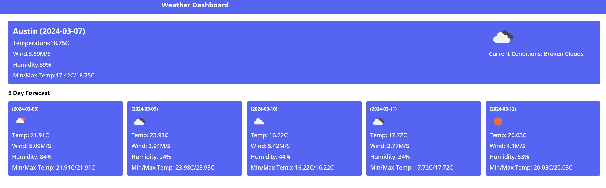

# Weather-Dashboard
Weather Dashboard

A weather dashboard that allows a user to get current city forecast as well as a mini 5 day forecast. 
Uses the OpenWeather API's to retrieve relevent information to display. 

User input will then display the following information:

## Known Issues

* While searched cities will go into local storage buttons do not work correctly 
* Clear History button has no functionality yet

 ## Deployment

Deployed project can be found here: 